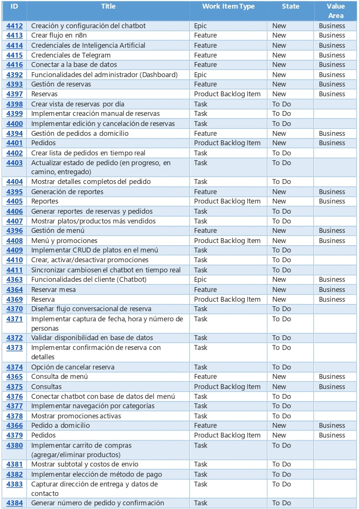
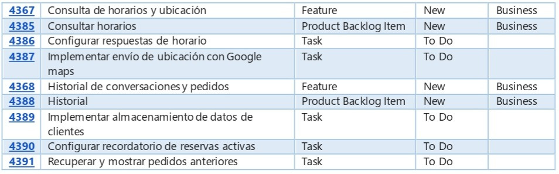
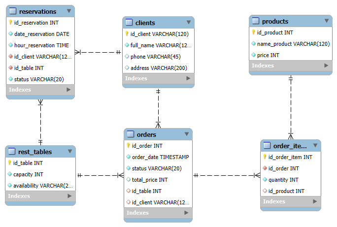
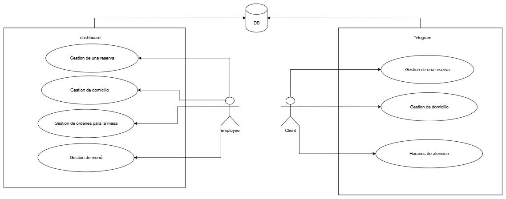

# Technical Documentation — Restaurant Management System

## 1. Project Introduction

### Project Name

Restaurant Management System — Reservations and Delivery

### Executive Summary

This technical document provides comprehensive documentation for a full-stack web application designed to modernize restaurant operations. The system addresses critical inefficiencies in traditional reservation and delivery management processes through an integrated digital solution.

The project demonstrates practical application of modern web development technologies, database design principles, and user experience considerations to solve real-world business challenges in the food service industry.

## 2. Problem Statement and Justification

### Current Industry Challenges

Restaurants typically manage reservations and delivery orders through:

- Manual phone-based systems prone to human error
- Social media platforms lacking systematic organization
- Paper-based tracking systems with limited scalability
- Disconnected processes between customer interaction and internal management

### Identified Pain Points

- **Information Loss**: Critical order details lost during peak hours
- **Schedule Conflicts**: Double-booking and reservation confusion
- **Customer Service Delays**: Inability to provide immediate responses
- **Operational Visibility**: Lack of real-time insights into business performance
- **Communication Gaps**: Inconsistent information between staff and customers
- **Manual Errors**: Human mistakes in order taking and reservation scheduling

### Business Impact

These challenges result in:

- Reduced customer satisfaction and retention
- Lost revenue from missed orders and cancellations
- Increased operational costs due to inefficient processes
- Staff burnout from managing complex manual systems
- Limited ability to scale operations during growth periods

## 3. Project Scope and Objectives

### General Objective

Develop and implement an integrated restaurant management system that digitizes reservation and delivery processes, providing measurable improvements in operational efficiency and customer satisfaction.

### Specific Objectives

#### Customer Experience Enhancement

- Implement a conversational interface for intuitive reservation booking
- Provide real-time menu access with current pricing and availability
- Enable seamless delivery order placement with cart management
- Deliver instant responses to common customer inquiries

#### Operational Efficiency Improvement

- Create centralized dashboard for comprehensive restaurant management
- Implement real-time order and reservation tracking capabilities
- Establish automated data recording with error reduction mechanisms
- Generate actionable business intelligence through reporting systems

#### Technical Excellence

- Deploy scalable, cloud-based infrastructure for reliable service delivery
- Implement secure data management with proper backup and recovery procedures
- Ensure responsive design for optimal user experience across devices
- Maintain high code quality standards with proper documentation and version control

### Project Scope Boundaries

#### Included Features

- Customer reservation management system
- Delivery order processing and tracking
- Administrative dashboard with full CRUD operations
- Menu management capabilities
- Basic reporting and analytics functionality
- Automated receipt printing for completed orders

#### Excluded Features

- Point of sale (POS) integration
- Advanced payment gateway implementation
- Multi-location restaurant chain support
- Advanced inventory management systems
- Third-party delivery platform integration

## 4. User Stories and Acceptance Criteria

### Customer Features (Chatbot)

#### Table Reservation

**User Story**: As a customer, I want to reserve a table for a specific date, time, and number of people to ensure a place at the restaurant.

**Acceptance Criteria**:
- The chatbot must guide me through the conversation, asking for date, time, and number of people
- Must confirm the reservation if there is availability
- If there is no availability, must offer other nearby dates or times
- Must ask for my name and phone number to contact me if necessary
- Upon completion, must send me a confirmation message with reservation details
- I must be able to cancel the reservation if needed

#### Menu Consultation

**User Story**: As a customer, I want to consult the menu to see what the restaurant offers and decide what to order.

**Acceptance Criteria**:
- The chatbot must show me the current menu clearly (dish name, description, price)
- I must be able to navigate through menu categories (e.g., "Appetizers", "Main Courses", "Desserts")

#### Delivery Order Placement

**User Story**: As a customer, I want to place a delivery order from the menu to receive my food at home.

**Acceptance Criteria**:
- The chatbot must allow me to add and remove products from the shopping cart
- Must show me the subtotal
- Must ask for my delivery address, name, and contact number
- Upon completion, must give me an order number and confirmation

#### Hours and Location Inquiry

**User Story**: As a customer, I want to consult the restaurant's hours and address to know when I can visit.

**Acceptance Criteria**:
- The chatbot must respond to questions about operating hours
- Must provide the exact restaurant address and, optionally, a Google Maps link

#### Conversation and Order History

**User Story**: As a regular customer, I want the chatbot to remember my information (name, phone, address) and the context of my last interaction to streamline future reservations or orders.

**Acceptance Criteria**:
- If I am a returning customer, the chatbot must be able to confirm my name and phone number
- Must be able to respond "sure, you already have a reservation for next Friday at 8pm" if I ask

### Administrator Features (Dashboard)

#### Reservation Management

**User Story**: As an administrator, I want a dashboard where I can view, create, and edit reservations to have complete control over restaurant occupancy.

**Acceptance Criteria**:
- I must be able to see a list of all reservations for a specific day
- I must be able to create a manual reservation for customers who call by phone
- I must be able to edit or cancel an existing reservation
- The dashboard must show if a reservation was made by the chatbot or manually

#### Delivery Order Management

**User Story**: As an administrator, I want to see and manage delivery orders to coordinate kitchen and delivery operations.

**Acceptance Criteria**:
- I must see a real-time list of orders
- I must be able to update order status (e.g., "In preparation", "On the way", "Delivered")
- The dashboard must show order details: dishes, delivery address, total cost

#### Receipt Printing

**User Story**: As an administrator, I want to generate and print order receipts to provide proper documentation for completed orders.

**Acceptance Criteria**:
- I must be able to generate a formatted receipt for any completed order
- The receipt must include order details, customer information, itemized list, and total
- The system must attempt to print to a POS printer if available
- If no printer is available, the system must save the receipt as a text file for later printing

#### Report Generation

**User Story**: As an administrator, I want to obtain sales reports and chatbot activity to make business decisions.

**Acceptance Criteria**:
- I must be able to see a daily report of reservations and orders
- The dashboard must show which are the best-selling dishes

#### Menu Management

**User Story**: As an administrator, I want to update the menu to keep the chatbot information current.

**Acceptance Criteria**:
- I must be able to add, edit, or delete menu items
- Changes must be reflected in the chatbot immediately

## 5. System Architecture and Design

### Architecture Overview

The system implements a modern three-tier architecture pattern ensuring separation of concerns, scalability, and maintainability.

#### Presentation Tier

**Technology**: React-based Single Page Application (SPA)

- **Purpose**: Provides intuitive user interface for restaurant administrators
- **Characteristics**: Responsive design, real-time updates, component-based architecture
- **Deployment**: GitHub Pages static hosting for optimal performance and reliability

#### Application Tier

**Technology**: Node.js with Express framework

- **Purpose**: Centralized business logic and API endpoints
- **Characteristics**: RESTful architecture, middleware-based request processing, modular design
- **Deployment**: Vercel serverless platform for automatic scaling and global distribution

#### Data Tier

**Technology**: Relational Database Management System

- **Purpose**: Persistent data storage with ACID compliance
- **Characteristics**: Normalized schema design, referential integrity, optimized queries
- **Structure**: Entity-Relationship model supporting complex business relationships

### Communication Flow

1. **Customer Interaction**: Chatbot interface communicates directly with backend API
2. **Data Processing**: Backend processes requests, validates data, and updates database
3. **Administrative Access**: Dashboard retrieves data through API endpoints for management functions
4. **Real-time Updates**: System maintains data consistency across all interfaces

## 6. Database Model and Structure

### Entity-Relationship Design

The database follows third normal form (3NF) principles to minimize redundancy and ensure data integrity.

#### Core Entities

**Customers Table**

- Primary Key: `user_id`
- Attributes: `name`, `phone`, `email`, `address`, `registration_date`
- Purpose: Stores customer information for personalized service

**Reservations Table**

- Primary Key: `reservation_id`
- Foreign Key: `user_id` (references Customers)
- Attributes: `reservation_date`, `reservation_time`, `guest_count`, `status`, `special_requests`
- Purpose: Manages table booking information with temporal constraints

**Orders Table**

- Primary Key: `order_id`
- Foreign Key: `user_id` (references Customers)
- Attributes: `order_date`, `subtotal`, `delivery_fee`, `total_amount`, `status`, `payment_method`, `delivery_address`
- Purpose: Tracks delivery orders with financial and logistical details

**Menu_Items Table**

- Primary Key: `item_id`
- Attributes: `name`, `description`, `price`, `category`, `availability`, `image_url`
- Purpose: Maintains current menu with pricing and categorization

**Order_Items Table** (Junction Table)

- Primary Keys: `order_id`, `item_id`
- Attributes: `quantity`, `unit_price`, `special_instructions`
- Purpose: Links orders to specific menu items with quantity and customization details

**Promotions Table**

- Primary Key: `promo_id`
- Attributes: `title`, `description`, `discount_percentage`, `start_date`, `end_date`, `status`
- Purpose: Manages promotional campaigns with temporal validity

### Relationships and Constraints

- One-to-Many: Customers can have multiple Reservations and Orders
- Many-to-Many: Orders contain multiple Menu Items through Order_Items junction table
- Referential Integrity: Foreign key constraints ensure data consistency
- Temporal Constraints: Date and time validations for reservations and promotions

## 7. System Features and Functionality

### Customer Interface (Chatbot)

#### Reservation Management

- **Feature**: Guided reservation booking process
- **Implementation**: Step-by-step conversation flow with date/time validation
- **Validation**: Real-time availability checking against existing reservations
- **Confirmation**: Automated confirmation messages with reservation details
- **Modification**: Ability to cancel or modify existing reservations

#### Menu and Order Management

- **Feature**: Interactive menu browsing with category filtering
- **Implementation**: Dynamic content loading from database with real-time pricing
- **Cart Management**: Session-based shopping cart with item quantity controls
- **Order Processing**: Complete order flow from selection to delivery details specification
- **Order Tracking**: Status updates from preparation to delivery completion

#### Information Services

- **Feature**: Instant access to restaurant information
- **Implementation**: Pre-configured responses for common inquiries
- **Location Services**: Integration with mapping services for directions
- **Hours and Policies**: Dynamic display of current operating hours and policies

### Administrative Interface (Dashboard)

#### Reservation Management System

- **Create**: New reservation entry with customer information validation
- **Read**: Comprehensive reservation viewing with filtering and search capabilities
- **Update**: Reservation modification with automatic customer notification
- **Delete**: Reservation cancellation with status tracking and reporting

#### Order Management System

- **Order Processing**: Real-time order queue with priority and timing information
- **Status Updates**: Progressive status tracking from received to delivered
- **Customer Communication**: Automated updates to customers regarding order progress
- **Financial Tracking**: Revenue calculation with detailed breakdown by items and fees

#### Receipt Printing System

- **Automatic Generation**: Formatted receipt creation for completed orders
- **POS Integration**: Direct printing to connected POS printers using ESC/POS protocol
- **Fallback System**: File-based receipt storage when printer is unavailable
- **Format Standards**: Industry-standard receipt layout with customer and order details

#### Menu Administration

- **Content Management**: Full CRUD operations for menu items
- **Category Organization**: Hierarchical menu structure with custom categorization
- **Pricing Management**: Dynamic price updates with effective date controls
- **Availability Control**: Real-time item availability toggling for out-of-stock situations

#### Reporting and Analytics

- **Sales Reports**: Revenue analysis by time period, menu category, and customer segment
- **Popular Items**: Data-driven insights into customer preferences and trends
- **Reservation Patterns**: Analysis of booking patterns for capacity optimization
- **Customer Analytics**: Return customer identification and behavior analysis

## 8. API Documentation and Endpoints

### Authentication and Security

All API endpoints implement proper request validation and error handling.

### Reservation Management Endpoints

#### Create Reservation

- **Method**: `POST /api/reservations`
- **Purpose**: Create new table reservation
- **Request Body**: Customer information, date, time, guest count
- **Response**: Confirmation with reservation ID and details
- **Validation**: Date/time availability, guest count limits, customer information format

#### Retrieve Reservations

- **Method**: `GET /api/reservations/:id`
- **Purpose**: Fetch specific reservation details
- **Parameters**: Reservation ID
- **Response**: Complete reservation information including customer details

#### Update Reservation

- **Method**: `PUT /api/reservations/:id`
- **Purpose**: Modify existing reservation
- **Request Body**: Updated reservation details
- **Validation**: Availability checking for new date/time if modified

#### Cancel Reservation

- **Method**: `DELETE /api/reservations/:id`
- **Purpose**: Cancel existing reservation
- **Response**: Cancellation confirmation and updated status

### Order Management Endpoints

#### Create Order

- **Method**: `POST /api/orders`
- **Purpose**: Process new delivery order
- **Request Body**: Customer information, order items, delivery details
- **Response**: Order confirmation with tracking number

#### Retrieve Order Details

- **Method**: `GET /api/orders/:id`
- **Purpose**: Fetch complete order information
- **Response**: Order status, items, customer details, delivery information

#### Update Order Status

- **Method**: `PUT /api/orders/:id`
- **Purpose**: Update order processing status
- **Request Body**: New status and optional notes
- **Response**: Updated order information with timestamp

#### List All Orders

- **Method**: `GET /api/orders`
- **Purpose**: Retrieve orders with filtering options
- **Query Parameters**: Date range, status, customer filters
- **Response**: Paginated order list with summary information

#### Print Order Receipt

- **Method**: `POST /api/orders/:id/print`
- **Purpose**: Generate and print formatted receipt for completed orders
- **Parameters**: Order ID
- **Response**: Print confirmation and receipt generation status
- **Functionality**: 
  - Retrieves order details, customer information, and itemized products
  - Formats data in POS-compatible layout with proper spacing and alignment
  - Attempts direct printing to USB-connected POS printer
  - Creates backup text file if printer is unavailable
  - Includes order number, customer details, itemized list, and total amount

### Menu Management Endpoints

#### Retrieve Menu

- **Method**: `GET /api/menu`
- **Purpose**: Fetch current menu items
- **Query Parameters**: Category filtering, availability status
- **Response**: Complete menu with pricing and descriptions

#### Add Menu Item

- **Method**: `POST /api/menu`
- **Purpose**: Add new menu item
- **Request Body**: Item details, pricing, category
- **Response**: Created item with assigned ID

#### Update Menu Item

- **Method**: `PUT /api/menu/:id`
- **Purpose**: Modify existing menu item
- **Request Body**: Updated item information
- **Response**: Confirmation of changes

#### Remove Menu Item

- **Method**: `DELETE /api/menu/:id`
- **Purpose**: Remove item from menu
- **Response**: Removal confirmation and updated availability

## 9. Receipt Printing System Implementation

### Technical Architecture

The receipt printing system is designed to provide seamless order documentation for restaurant operations.

#### Core Components

**Receipt Generation Engine**
- Formats order data into industry-standard receipt layout
- Applies proper spacing and alignment for POS printer compatibility
- Supports Colombian peso currency formatting
- Handles long product names with ellipsis truncation

**Printer Integration Module**
- Uses ESC/POS protocol for direct printer communication
- Supports USB-connected thermal printers
- Implements automatic device detection and connection management
- Provides graceful fallback when hardware is unavailable

**File System Backup**
- Creates text-based receipt files when printer is offline
- Stores receipts in organized directory structure
- Enables manual printing or email delivery of receipts
- Maintains receipt history for accounting and customer service purposes

### Implementation Details

#### Receipt Format Structure

```
ORDEXX
------------------------
Invoice #[ORDER_ID]
Customer: [CUSTOMER_NAME]
Phone: [PHONE_NUMBER]
Address: [DELIVERY_ADDRESS]
Date: [ORDER_DATE]
------------------------
Product         Qty   Price
[ITEMIZED_LIST]
------------------------
Total:                [TOTAL_AMOUNT]
```

#### Error Handling and Fallbacks

- **Primary Path**: Direct printing to connected POS printer
- **Fallback Path**: File creation in `/receipts` directory
- **Error Logging**: Comprehensive error tracking for troubleshooting
- **Status Reporting**: Real-time feedback to dashboard about print success/failure

## 10. Installation and Deployment Guide

### Development Environment Setup

#### System Requirements

- Node.js version 14.0 or higher
- npm package manager version 6.0 or higher
- Git for version control (recommended)
- Modern web browser for testing
- USB POS printer (optional, for receipt printing functionality)

#### Repository Access and Setup

1. **Clone Repository**:
   ```bash
   git clone https://github.com/JMoralesNunez/Proyecto_Integrador.git
   cd Proyecto_Integrador
   ```

#### Backend Configuration

1. **Navigate to backend directory**:

   ```bash
   cd backend
   ```

2. **Install dependencies**:

   ```bash
   npm install
   ```

3. **Environment Configuration**:
   Create `.env` file with required variables:

   ```
   DB_HOST=168.119.183.3
   DB_PORT=5432
   DB_USER=root
   DB_PASSWORD=s7cq453mt2jnicTaQXKT
   DB_NAME=testRes
   APP_PORT=3001
   ```

4. **Start development server**:
   ```bash
   npm run dev
   ```

#### Frontend Configuration

1. **Navigate to frontend directory**:

   ```bash
   cd frontend
   ```

2. **Install dependencies**:

   ```bash
   npm install
   ```

3. **Start development server**:

   ```bash
   npm start
   ```

4. **Access application**:
   Open browser to `http://localhost:3000`

### Production Deployment

#### Backend Deployment (Vercel)

- **Platform**: Vercel serverless hosting
- **URL**: https://proyecto-integrador-backend.vercel.app
- **Features**: Automatic scaling, global CDN, environment variable management
- **Configuration**: Automatic deployment from GitHub repository

#### Frontend Deployment (GitHub Pages)

- **Platform**: GitHub Pages static hosting
- **URL**: https://jmoralesnunez.github.io/Proyecto_Integrador_Frontend/
- **Features**: Free hosting, automatic SSL, custom domain support
- **Configuration**: Automated deployment from repository main branch

### Database Deployment Considerations

- Production database requires separate hosting solution
- Connection strings must be updated in environment variables
- Database migrations and seeding procedures should be documented
- Backup and recovery procedures must be established for production use

## 11. Future Enhancement Opportunities

### Technical Improvements

- **Real-time Communication**: WebSocket implementation for live order updates
- **Caching Strategy**: Redis integration for improved response times
- **API Rate Limiting**: Implementation of request throttling for security
- **Automated Testing**: Unit and integration test suites for quality assurance
- **Error Monitoring**: Comprehensive logging and error tracking systems

### Feature Expansions

- **Payment Integration**: Secure payment gateway implementation
- **Mobile Applications**: Native iOS and Android applications
- **Multi-language Support**: Internationalization for diverse customer bases
- **Advanced Analytics**: Machine learning for demand forecasting
- **Loyalty Programs**: Customer retention and reward systems

### Business Scalability

- **Multi-location Support**: Chain restaurant management capabilities
- **Third-party Integrations**: Food delivery platform APIs
- **Inventory Management**: Stock tracking and supplier management
- **Staff Scheduling**: Employee management and scheduling tools
- **Customer Feedback**: Review and rating systems with sentiment analysis

## 12. Evidences of SCRUM methodology: 

## *Azure*

  

## 13. Diagrams:

## *Entity-relation model*


## *Usage diagram*


## 14. Project Contributors

This comprehensive system was developed as part of an Integrative Project by a dedicated team of software developers:

- **Jhonatan Morales** - Project Lead and Backend Architecture
- **Angelica Cuervo** - Frontend Development and User Experience
- **Miguel Arias** - Database Design and API Development
- **Omar Uribe** - System Integration and Testing
- **Jhon Rojas** - Documentation and Quality Assurance

## 15. Conclusion

The Restaurant Management System represents a comprehensive solution to modernize restaurant operations through thoughtful application of current web technologies. The system successfully addresses real-world business challenges while demonstrating best practices in software development, database design, and user experience considerations.

This technical documentation serves as a complete reference for understanding, maintaining, and extending the system's capabilities to meet evolving business requirements in the competitive food service industry.